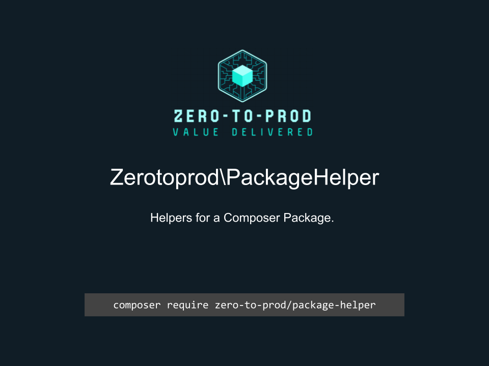

# Zerotoprod\PackageHelper



[](https://github.com/zero-to-prod/package-helper)
[](https://github.com/zero-to-prod/package-helper/actions)
[](https://packagist.org/packages/zero-to-prod/package-helper/stats)
[](https://packagist.org/packages/zero-to-prod/package-helper/stats)
[](https://packagist.org/packages/zero-to-prod/package-helper)
[](https://github.com/zero-to-prod/package-helper/blob/main/LICENSE.md)
[](https://wakatime.com/badge/github/zero-to-prod/package-helper)
[](https://hitsofcode.com/github/zero-to-prod/package-helper/view?branch=main)

## Contents

- [Introduction](#introduction)
- [Requirements](#requirements)
- [Installation](#installation)
- [Usage](#usage)
- [Example](#example)
- [Local Development](./LOCAL_DEVELOPMENT.md)
- [Contributing](#contributing)

## Introduction

Helpers for a composer package.

## Requirements

- PHP 7.1 or higher.

## Installation

Install `Zerotoprod\PackageHelper` via [Composer](https://getcomposer.org/):

```bash
composer require zero-to-prod/package-helper
```

This will add the package to your project’s dependencies and create an autoloader entry for it.

## Usage

Publish files in your package directory.

```php
use Zerotoprod\OmdbModels\PackageHelper;

PackageHelper::publish(
    $from,
    $to,
    PackageHelper::findNamespaceMapping($psr_4, $to),
    static function(string $from, string $to){
        echo "Copied: $from to $to" . PHP_EOL;
    }
);
```

## Example

Integrate this into a composer package.

Update `composer.json`:

```json
{
  "bin": [
    "bin/package-file"
  ]
}
```

Create a new file: `bin/package-file`

```php
#!/usr/bin/env php
<?php

require getcwd() . '/vendor/autoload.php';

use Zerotoprod\OmdbModels\PackageHelper;

if ($argc !== 2) {
    die("Usage: <targetDir>\n");
}

$from = __DIR__ . '/../src';
if (!is_dir($from)) {
    throw new RuntimeException("Source directory '$from' not found.");
}

$composer_json_file_path = getcwd() . '/composer.json';
if (!is_file($composer_json_file_path)) {
    throw new RuntimeException("composer.json not found.");
}

$composer_json_data = json_decode(file_get_contents($composer_json_file_path), true);
$psr_4 = $composer_json_data['autoload']['psr-4'] ?? null;

if (!$psr_4) {
    throw new RuntimeException('PSR-4 autoload section missing in composer.json.');
}

$to = rtrim($argv[1], '/');
PackageHelper::publish(
    $from,
    $to,
    PackageHelper::findNamespaceMapping($psr_4, $to),
    static function(string $from, string $to){
        echo "Copied: $from to $to" . PHP_EOL;
    }
);
```

## Contributing

Contributions, issues, and feature requests are welcome!
Feel free to check the [issues](https://github.com/zero-to-prod/package-helper/issues) page if you want to contribute.

1. Fork the repository.
2. Create a new branch (`git checkout -b feature-branch`).
3. Commit changes (`git commit -m 'Add some feature'`).
4. Push to the branch (`git push origin feature-branch`).
5. Create a new Pull Request.